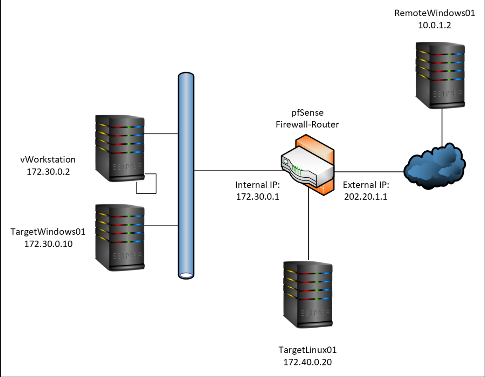
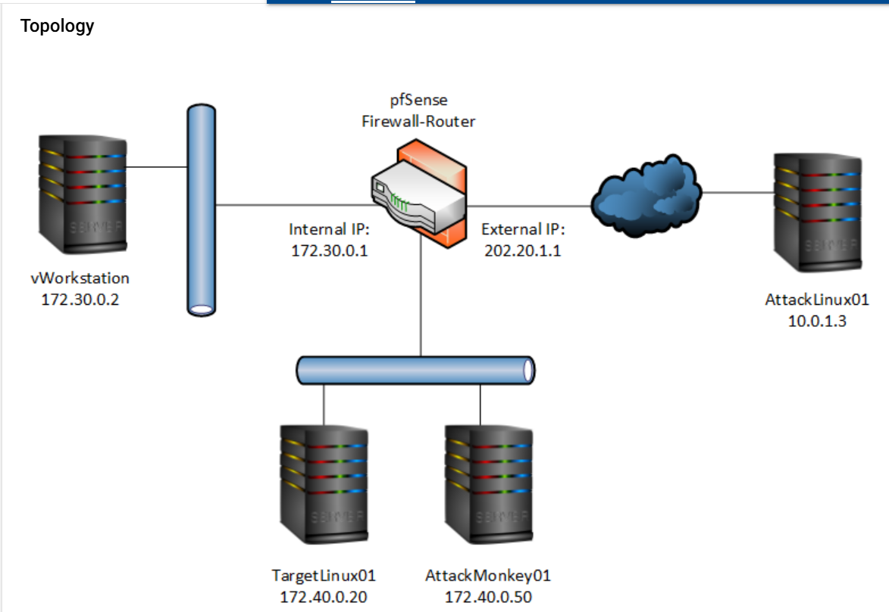

# Shoumya Rayamajhi 
## Cyber Security Portfolio  

Welcome to my cybersecurity portfolio. Below are selected lab projects demonstrating network analysis, attack simulation, defense strategies, and security auditing.

---

# Lab 1: Internal Network Analysis  

Conducted a simulated internal network assessment in a controlled lab environment to identify active hosts, open ports, and potential security exposures. Used Zenmap for host discovery and service enumeration, and Wireshark to capture and analyze live network traffic.  

This lab strengthened my understanding of network reconnaissance, packet analysis, and basic Linux command-line operations while reinforcing ethical testing practices.

### Virtual Lab Topology

📄 **[Download Full Lab Report (PDF)]([Assessing the Network with Common Security Tools (4e) - Shoumya Rayamajhi.pdf](Lab1.pdf)**

---

# Lab 2: Attack Simulation & Defense  

Conducted a controlled attack-and-defense simulation within a lab environment to understand exploitation techniques and detection strategies. Used Metasploit to simulate exploitation scenarios, basic Linux commands to manage the environment, and Infection Monkey to model lateral movement and identify security gaps.  

The lab focused on detecting attack behavior and implementing defensive measures to improve security posture.

### Virtual Lab Topology

📄 **[Download Full Lab Report (PDF)]([Defending the Network from a Simulated Attack (4e) - Shoumya Rayamajhi.pdf](Lab2.pdf)**

---

# Lab 3: Network Design & Segmentation  

Designed and simulated a segmented enterprise-style network using GNS3 to model multiple LANs and VLANs. Configured pfSense as a firewall and router to enforce segmentation and apply traffic control rules. Used Wireshark to capture and analyze traffic between VLANs, validating firewall policies and network isolation.  

This lab strengthened my understanding of network architecture and secure segmentation.

### Virtual Lab Topology

📄 **[Download Full Lab Report (PDF)]([Designing a Secure Network Topology (4e) - Shoumya Rayamajhi.pdf](Lab3.pdf)**

---

# Internal Security Audit  

Conducted a structured internal security audit using a standardized assessment template to evaluate policies, configurations, and basic security controls. Identified potential risks and provided remediation recommendations to improve overall security posture.

📄 **[Download Full Audit Report (PDF)]([Controls and compliance checklist(put in resume).pdf](Audit.pdf)**

---

# Contact Me  

Email: its.shaw3@gmail.com 
Phone: 945-246-0375
Location: Irving, Tx

I am actively seeking cybersecurity internship opportunities in network security, SOC analysis, and defensive security roles.
